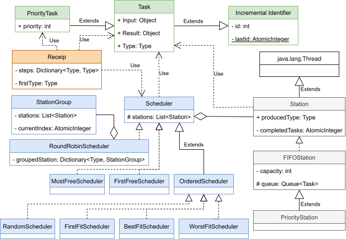
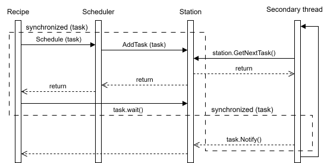
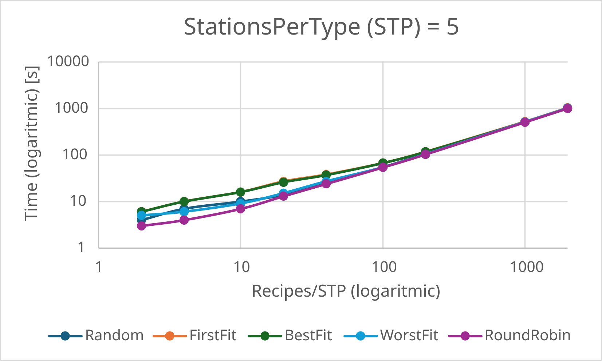
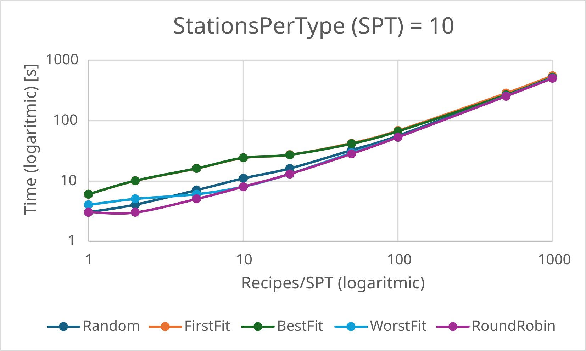
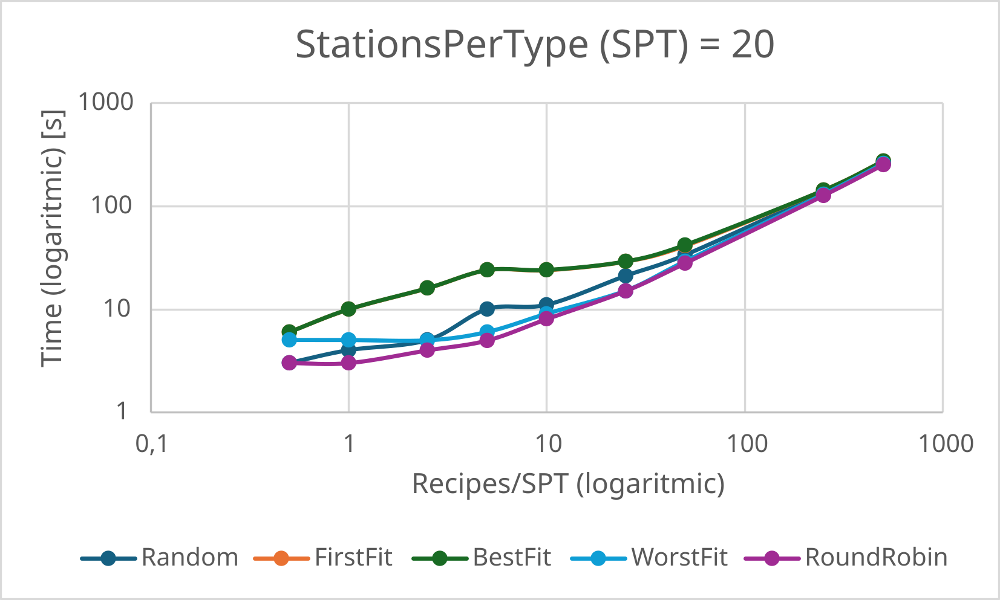

# "McDonald" scheduler
Simulation a line of production described via these classes.

This is a simple project for the **Java programming fundamentals** course (3 ECTS) at [Sant'Anna School of Advanced studies](https://santannapisa.it), held by the professor *Tommaso Cucinotta*.

## `Task`
Represents an operation. Converts an object (Input) to an other (Result) of a specified Type.
The Task is generated by a [Receip](#receip), scheduled by a [Scheduler](#scheduler) and executed by a [Station](#station).
A task doing work is, in practice, calling the constructor for the expected result class, passing the task input as parameter. To simulate real world scenarios, in the simulations delays are added inside the constructors.

## `Station`
Produces a specified Type of product and to it can be assigned the [Tasks](#task) that aim to create that specific type.
It is implemented via a daemon thread that constantly executes the tasks that can be executed.

## `Scheduler`
Can schedule [Tasks](#task) to the [Stations](#station).

The scheduler holds the criteria on which is chosen the `Station` to assign the `Task` at.

Many examples [below](#avaible-schedulers).

## `Recipe`
Keeps track of how the final product is built. When a [Task](#task) finishes, the `Recipe` retrieves its result and creates the new `Task` for the next step in the production line. 



# Run the simulations

A very simple simulation is found in the [`simulation/simple`](./simulation/simple/) folder.

```bash
javac -d . simulation/simple/Main.java
java simulation.simple.Main
```

One that tests the system with multiple receips and no priorities is found in the [`simulation/multiple_recipes`](./simulation/multiple_recipes/) folder.

```bash
javac -d . simulation/multiple_recipes/Main.java
java simulation.multiple_recipes.Main
```

A more sophisticated (different types of scheduling and introducing priorities) simulation is found in the [`simulation/priority`](./simulation/priority/) folder.

```bash
javac -d . simulation/priority/Main.java
java simulation.priority.Main
```

A simulation with many different schedulers, and many concurrent receips is found in the [`simulation/big`](./simulation/big/) folder.

```bash
javac -d . simulation/big/Main.java
java simulation.big.Main
```

This simulation was used to obtain the charts [below](#performance).

# Avaible schedulers

There are many possible schedulers provided, and can be found in the 
[`models/scheduler`](./models/scheduler/) folder.

## Greedy schedulers

### [FirstStationScheduler](./models/scheduler/greedy/FirstStationScheduler.java)

Assigns a Task to the first Station found that can handle the requested work. If that station is temporarily unavaible, the scheduler waits until it becomes ready to accept the requested job.

This policy keeps the number of running stations to the least possible value, sacrificing production time. 

### [MostFreeScheduler](./models/scheduler/greedy/MostFreeScheduler.java)

Assigns a Task to the, relatively to its capacity, least filled station. If needed, waits until the station becomes avaible.

Comparison between station, to determine which is the least filled, works only if the station is an instance (or derived) of [`FIFOStation.java`](./models/station/FIFOStation.java).

## Order-based schedulers

These are schedulers that order the stations with a certain criteria and then try to assign the task to the first station they find (after the ordering) that can handle the requested job in this moment. No waiting for a _chosen_ station to free itself.

### [RandomScheduler](./models/scheduler/ordered/RandomScheduler.java)

Shuffles the avaible stations list instead of ordering it.

### [FirstFitScheduler](./models/scheduler/ordered/FirstFitScheduler.java)

Does not order at all. The first station that can handle the task at this moment gets chosen.

### [BestFitScheduler](./models/scheduler/ordered/BestFitScheduler.java)

Orders the stations based on the current number of tasks they have in their queues.
The "least free" is chosen.

### [WorstFitScheduler](./models/scheduler/ordered/WorstFitScheduler.java)

Orders the stations based on the current number of tasks they have in their queues.
The "most free" is chosen.

## Complex schedulers

More sophisticated, rely on additional structures.

### [RoundRobinScheduler](./models/scheduler/complex/RoundRobinScheduler.java)

Keeps the stations in groups (based on the produced type) and an index for each group.

At every schedule of a task, the station currently pointed by the index is chosen, while the index itself is atomically incremented.

# Locking and mutexes



# Performance

By using the [`simulation/big`](./simulation/big/) simulation, we can benchmark the various schedulers.

[Round Robin](#roundrobinscheduler) is clearly the best performing of them all.

From multiple runs with different amounts of Recipes requested simultaneously, it is deduced that the execution time, for each scheduler, depends on the ratio

$$ \frac{Recipes}{SPT} $$

where $SPT$ is the number of stations active per product **step**.

The more this ratio increases, the more the difference between ["order based"](#order-based-schedulers) schedulers and [Round Robin](#roundrobinscheduler) is low.





The csvs used to generate the charts can be found in the [`assets/data`](./assets/data/) folder.